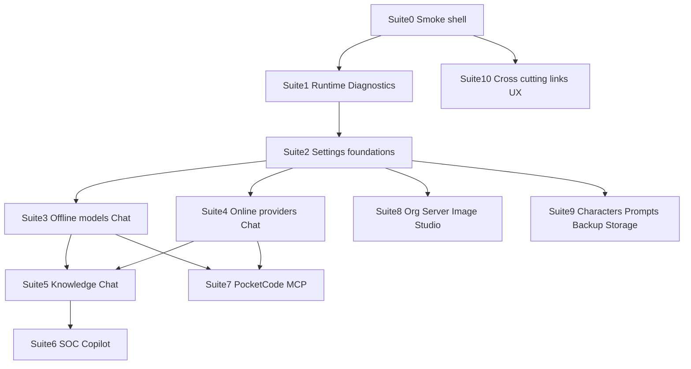

# PocketMind Hybrid AI — End-to-End Test Master Plan

> Durable checklist for Windows desktop QA. Automated verification notes live in [`E2E_VERIFICATION_RESULTS.md`](E2E_VERIFICATION_RESULTS.md).

## Purpose

Prove every shipped user-facing capability works on a real Windows desktop session (your current environment: data root `D:\NexusAI`, DeepSeek V4 Pro online, local Phi-3 / downloadable GGUFs, llama-server found, GPU often CPU-fallback). This plan is the execution script; failures are logged with screenshot + steps to reproduce.

**Outcomes when testing is done**

- Pass / Fail / Blocked / N/A for every suite below
- Evidence folder: screenshots + exported MD/JSON/TXT (+ SOC reports)
- Defect list with severity and file/area hints
- Optional follow-up: write [`E2E_TEST_PLAN.md`](E2E_TEST_PLAN.md) into the repo as the durable checklist (same content)

## Truth vs assumptions (do not invent features)

| Expectation | Actual product |
|-------------|----------------|
| Chat export PDF | **Not implemented.** Chat **Export as…** = **MD / JSON / TXT** only ([`src/chatExport.ts`](src/chatExport.ts)) |
| Compare rewrite = auto LLM rewrite | Manual **diff**: paste original vs last assistant ([`ChatView.tsx`](src/components/ChatView.tsx) + [`DiffViewer.tsx`](src/components/DiffViewer.tsx)) |
| Advanced “App Version 0.1.0” | May still show stale string — **verify vs** `package.json` `1.0.0` |
| Get key links | Must open system browser via Tauri shell ([`src/openExternal.ts`](src/openExternal.ts)); no false error dialog |
| Restore this run | Only meaningful after PocketCode **edits**; empty checkpoint after 402 is expected |

## Test environment (lock before Suite 0)

Record once:

- Build: staged payload or `tauri:dev:low-mem`
- OS / RAM / GPU detection (Runtime page)
- Data root: `D:\NexusAI` (from your Deployment screenshot)
- Models dir, embeddings, reranker paths
- Online keys available: DeepSeek (+ others if any)
- Local GGUF available: Phi-3 Mini path shown; optional TinyLlama download
- Company SOC data path if testing SOC: e.g. `D:\NexusAI\company-data` or Fortinet pack
- PocketCode workspace folder (non-production sample repo preferred)

**Global pass rules**

- No crash / white screen / hung UI > 60s without status
- Errors are human-readable (not raw panic)
- Destructive actions confirm first
- No silent model failover

**Evidence convention**

- Screenshot naming: `S##-step-short-name.png`
- Exports: keep under `D:\NexusAI\exports\e2e\`
- Log failures in a running defect table (ID, suite, severity, steps, expected, actual)

---

## Suite 0 — App shell / navigation smoke (15–20 min)

**Entry:** cold start → maximized window

| # | Action | Expected |
|---|--------|----------|
| 0.1 | Launch app | Opens maximized; no blank shell |
| 0.2 | If first run, Setup wizard | Welcome → Engine → Models folder → Import/Skip → Ready |
| 0.3 | Walk Sidebar: Home, Chats, Fortinet Copilot, Knowledge Chat, PocketCode, Models, Org Server, Image Studio | Each view loads without crash |
| 0.4 | Tools: System, Runtime, Diagnostics, Prompts, Characters, Storage, Backup, Help, Settings | Same |
| 0.5 | Collapse/expand sidebar; history rail modes | History switches per chat/KC/PocketCode/SOC |
| 0.6 | Footer status | Shows Ready / online or clear offline state |
| 0.7 | Quick compose hotkey (if enabled) | Overlay opens; Send to chat works |

**Pass:** all views mount. **Fail:** any uncaught error boundary or stuck spinner.

---

## Suite 1 — Runtime / Hardware / Diagnostics (30–45 min)

### 1A Runtime Manager ([`RuntimeManager.tsx`](src/components/RuntimeManager.tsx))

| # | Action | Expected |
|---|--------|----------|
| 1.1 | **Scan engine** | ENGINE Found/Missing clear; GPU SPEED-UP Ready/Unavailable; AUTO PLAN coherent (CPU fallback OK if no GPU) |
| 1.2 | Apply **CPU Safe** | GPU layers 0; status updates |
| 1.3 | Apply **Automatic** | Returns to auto / layers -1 semantics |
| 1.4 | **Balanced split** / **Max GPU** | Settings apply; if no GPU, Max GPU still safe (no crash) |
| 1.5 | **Copy report** | Clipboard contains engine/GPU text |

### 1B Hardware ([`HardwareMonitor.tsx`](src/components/HardwareMonitor.tsx))

| # | Action | Expected |
|---|--------|----------|
| 1.6 | Open System / Hardware | RAM/CPU/GPU cards populate; refresh updates |

### 1C Diagnostics ([`DiagnosticsPanel.tsx`](src/components/DiagnosticsPanel.tsx))

| # | Action | Expected |
|---|--------|----------|
| 1.7 | **Run checks** | Cards: llama-server, runtime health, memory, selected model |
| 1.8 | **Repair tooling** / Refresh | Ripgrep/Python/Node paths resolve; “Bundled tooling ready” |
| 1.9 | Allowlisted runners list | Shows available vs missing (e.g. python/js/ts) |
| 1.10 | **Run tok/s test** (with small local model loaded if possible) | Completes or clear skip reason |
| 1.11 | **Stop Local Engine** | Engine stops; subsequent chat may restart engine |
| 1.12 | **Copy report** | Clipboard non-empty |

---

## Suite 2 — Settings foundations (45–60 min)

Use your pasted Deployment + Security text as the baseline.

### 2A General

| # | Action | Expected |
|---|--------|----------|
| 2.1 | Theme Light / Dark / System | UI updates immediately |
| 2.2 | Accent color swatches | Accent changes |
| 2.3 | Performance cards (Low RAM → Max Quality) | Persist after tab switch |

### 2B Providers ([`SettingsPanel.tsx`](src/components/SettingsPanel.tsx))

| # | Action | Expected |
|---|--------|----------|
| 2.4 | **Get key** for Groq, Cerebras, DeepSeek, OpenAI, etc. | System browser opens; **no false “Could not open” alert** |
| 2.5 | Paste DeepSeek key → **Test** → **Save** | Valid key OK; balance/402 treated as auth-with-warning if applicable |
| 2.6 | Empty/invalid key Test | Clear failure message |
| 2.7 | Remove key | Key cleared; models requiring it fail clearly |

### 2C MCP ([`McpSettingsPanel.tsx`](src/components/McpSettingsPanel.tsx))

| # | Action | Expected |
|---|--------|----------|
| 2.8 | Reload config; see `workspace-fs` | Config path shown (e.g. under app-data) |
| 2.9 | Enable server; **Test connection** | Pass or actionable error |
| 2.10 | **Connect Cursor** / **Sync to Cursor** | Writes/updates project `.cursor/mcp.json` without crash |
| 2.11 | Disable server | Composer MCP list updates |

### 2D Deployment ([`DeploymentSettingsPanel.tsx`](src/components/DeploymentSettingsPanel.tsx))

| # | Action | Expected |
|---|--------|----------|
| 2.12 | Confirm Server vs Workstation mode | Matches UI |
| 2.13 | Verify paths: data root, models, embeddings, reranker, SOC, export, dense index | Match `D:\NexusAI\...` |
| 2.14 | Change temperature or top-K → **Save** → **Reload** | Values persist |
| 2.15 | **Apply workstation preset** then re-apply server if needed | Limits change as labeled; Save works |
| 2.16 | Invalid path (optional) | Clear validation / create dirs behavior documented |

### 2E Security ([`SecuritySettingsPanel.tsx`](src/components/SecuritySettingsPanel.tsx))

| # | Action | Expected |
|---|--------|----------|
| 2.17 | Toggle “Require strong document matches”; set scores | Save/Reload persist |
| 2.18 | Hardware profile / Chat style / indexing checkboxes | Persist; note “rebuild index after change” |
| 2.19 | OCR engine + preprocess; master Image RAG **off** by default | Offline OCR path OK; online vision stays off until enabled |
| 2.20 | If Image RAG tested: enable + Test connection | Pass/fail clear; Remove API key works |
| 2.21 | Audit log toggle | Affects whether Audit tab gets new events |

### 2F Audit ([`AuditLogPanel.tsx`](src/components/AuditLogPanel.tsx))

| # | Action | Expected |
|---|--------|----------|
| 2.22 | Trigger a KC search or settings save | New rows after Refresh |
| 2.23 | Filter + **Export CSV** | File writes; opens/readable |

### 2G Advanced

| # | Action | Expected |
|---|--------|----------|
| 2.24 | **Open Folder** (local data) | Explorer opens data root |
| 2.25 | **Generate Debug Report** | Report content / file |
| 2.26 | App version string | Should reflect **1.0.0** (file defect if still 0.1.0) |
| 2.27 | **Reset Application** | **Do last** on a throwaway profile only; confirm dialog; data cleared |

---

## Suite 3 — Offline models + Chat deep dive (your template, expanded) (60–90 min)

**Goal:** Download/import → health → multi-length prompts → export → compare → delete/rename → unload → context/stop/formatting.

### 3A Acquire local model ([`ModelManager.tsx`](src/components/ModelManager.tsx))

| # | Action | Expected |
|---|--------|----------|
| 3.1 | Models → **Offline GGUF** | Library + Recommended Downloads |
| 3.2 | Prefer existing Phi-3 **or** download TinyLlama / Qwen small | Progress UI: speed/ETA/status; completes |
| 3.3 | Vision rows (Qwen2-VL): download GGUF + mmproj if tested | Both assets present; no silent half-download |
| 3.4 | Spot duplicate **Download Q4_K_M** buttons (32B/70B cards) | Record UI defect if duplicate; click once only |
| 3.5 | **Use** on local model | Active answer model updates |
| 3.6 | **Run Health Check** | Pass with short hello; time shown |
| 3.7 | Path display (`\\?\D:\...`) | Does not break Use/Open Chat |

### 3B Chat generation matrix ([`ChatView.tsx`](src/components/ChatView.tsx))

For **each** prompt class, capture screenshot + note latency/quality:

| ID | Prompt class | Example | Check |
|----|--------------|---------|-------|
| P1 | Tiny | `Say hello in one sentence.` | Direct, no loop |
| P2 | Medium (~200 tokens ask) | Explain a short concept | Coherent paragraphs |
| P3 | Long ask | Multi-bullet requirements | Completes or hits max_tokens cleanly |
| P4 | Code | Small Python function request | Fenced code formatting |
| P5 | Lists / markdown | Ask for numbered steps + table | Markdown renders (headers/lists/code) |
| P6 | Empty / whitespace send | Disabled send | Cannot send |
| P7 | Stop mid-stream | Send long prompt → **Stop** | Stops; UI idle; no zombie generation |
| P8 | Context stress | Many turns then Tuning → Keep last N | Budget bar; older dropped note; still sends |
| P9 | Attachment | Attach `.txt` / small `.md` | Chip shown; answer uses file; no dump of raw context into bubble |
| P10 | Params | Tuning: lower max tokens / temp | Shorter/colder replies |

Deployment limits from your settings (context 4096, max 512) should visibly cap long replies.

### 3C Chat management / export / compare

| # | Action | Expected |
|---|--------|----------|
| 3.8 | First message auto-renames chat | Title changes |
| 3.9 | Sidebar ⋮ **Rename** / **Copy chat** / **Delete** | Confirm delete; rename sticks |
| 3.10 | **Export as… → MD** | Save dialog; file opens; content matches |
| 3.11 | Export **JSON** and **TXT** | Same |
| 3.12 | Do **not** expect PDF | If UI implies PDF elsewhere, mark N/A for chat |
| 3.13 | **Compare rewrite** | Paste earlier draft; Original/Proposed diff visible |
| 3.14 | **Unload** | Status unload message; generation requires reload/select again |
| 3.15 | Delete chat while generating | Blocked or Stop first |

### 3D Characters interaction (light)

| # | Action | Expected |
|---|--------|----------|
| 3.16 | Characters → Add & Use coding persona → New chat | System behavior matches persona; header shows character |

**Suite 3 pass bar:** Health + P1–P7 + exports MD/JSON/TXT + unload + stop all green.

---

## Suite 4 — Online providers + Chat (30–45 min)

| # | Action | Expected |
|---|--------|----------|
| 4.1 | Models → Online Premium → **DeepSeek V4 Pro** → Use | Active model `remote:deepseek/deepseek-v4-pro` |
| 4.2 | Chat P1 | Streams; no local llama required |
| 4.3 | Insufficient balance / 402 | Clear payment/balance error (not crash); no fake Done-success for PocketCode later |
| 4.4 | Switch to another online model if key exists (Groq/Gemini) | Works independently |
| 4.5 | Unload online model | Message that online models aren’t local-resident |
| 4.6 | Get key links from Models page | Browser opens, no false alert |
| 4.7 | Vision online model (Gemini) + image attach | If key+vision model: describes image; else clear “no vision” notice |

---

## Suite 5 — Knowledge Chat (60–90 min)

**Entry:** Knowledge Chat → Collection panel. Prefer `test-fixtures/kc-qa-corpus` or a small docs folder.

| # | Action | Expected |
|---|--------|----------|
| 5.1 | Create/select collection; set folder | Root path correct |
| 5.2 | Confirm embedding + reranker paths (from Deployment) | Health shows presence/absence honestly |
| 5.3 | **Scan Folder** → **Build Index** | Progress events; completes; chunk counts > 0 |
| 5.4 | Collection Health | FTS/dense/coverage; no crash if dense missing |
| 5.5 | Ask 3 grounded questions with known answers | Answer + Evidence + sources; confidence badge |
| 5.6 | Ask out-of-corpus question with strong-match ON | “Not enough evidence” / blocked generation — not hallucination |
| 5.7 | Toggle Security indexing options → rebuild | Index reflects change (or clear rebuild required message) |
| 5.8 | Eval panel run | Metrics table; no hang |
| 5.9 | Stop mid-answer | Stops cleanly |
| 5.10 | Audit log after search | `kc.search` (or similar) appears if audit on |
| 5.11 | Codebase explorer mode (Security chat style) if enabled | Symbol/file-purpose style answers on a code folder |

---

## Suite 6 — Fortinet SOC Copilot (45–60 min)

| # | Action | Expected |
|---|--------|----------|
| 6.1 | Open Fortinet Copilot | Incident form + actions |
| 6.2 | Load practice scenario | Fields populate |
| 6.3 | Triage / Investigation → **Send to Chat** | Chat opens with grounded prompt |
| 6.4 | Company knowledge collection link/scan | Uses SOC data root |
| 6.5 | Validators run | Pass/fail details; no placeholder TODOs left unmarked |
| 6.6 | Reports generate + export | File under export dir |
| 6.7 | Data pack intake checklist | Status updates |
| 6.8 | Disclaimer present | Human-approval wording visible |

---

## Suite 7 — PocketCode + MCP (60–90 min)

**Workspace:** throwaway folder (not the full product repo if avoidable).

### 7A Modes

| # | Action | Expected |
|---|--------|----------|
| 7.1 | Open folder; tree lists files | |
| 7.2 | **Ask** mode: “What does X do?” | Read tools only; no writes |
| 7.3 | **Plan** mode: small feature request | `create_plan`; Plan Review UI; no source edits until Build |
| 7.4 | Approve → **Build** | Switches Agent; executes plan |
| 7.5 | **Agent** + DeepSeek/local capable model: “Create `hello.py` at workspace root printing hi” | File at **root** (not inventing `new_folder/`); permission overlays for risky tools |
| 7.6 | **Debug** mode with a deliberate bug + log/screenshot if available | Minimal fix path |
| 7.7 | Sandbox `run_command` (python print) | Permission → allowlisted run → result card |
| 7.8 | Delete file tool | Confirm overlay; reject path leaves file |
| 7.9 | Checkpoint restore after real edit | Restores content; status message visible |
| 7.10 | Restore after failed gen (no edits) | “Nothing to restore…” — button hidden or honest message |
| 7.11 | MCP tool call with server enabled | Confirm overlay; result returns |
| 7.12 | Stop agent mid-run | Cancels; idle |

### 7B Model gates

| # | Action | Expected |
|---|--------|----------|
| 7.13 | Tiny local model for Agent | Clear not-allowed / weak model messaging if gated |
| 7.14 | DeepSeek V4 Pro Agent | Native tools path; balance errors clear |

---

## Suite 8 — Org Server + Image Studio (30–45 min)

### 8A Org Server ([`EnterpriseServer.tsx`](src/components/EnterpriseServer.tsx))

| # | Action | Expected |
|---|--------|----------|
| 8.1 | URL `http://192.168.1.50:8000/v1` → **Test connection** | Pass if server up; clear fail if down |
| 8.2 | **Load models** / Save | List populates when up |
| 8.3 | Server RAG / embeddings checkboxes | Persist; offline server falls back per copy |
| 8.4 | Use server model in Chat | Streams from org endpoint |
| 8.5 | **Copy report** | Clipboard |

### 8B Image Studio ([`ImageStudio.tsx`](src/components/ImageStudio.tsx))

| # | Action | Expected |
|---|--------|----------|
| 8.6 | Free online generate with sample prompt | Image or clear network error |
| 8.7 | Open / Save (external) | Browser opens image URL; no false error dialog |
| 8.8 | Premium / Offline tabs | Honest catalog/disabled messaging if not configured |
| 8.9 | Style filters | UI filters models/cards |

---

## Suite 9 — Characters, Prompts, Backup, Storage, Help, Home (45–60 min)

### 9A Characters ([`CharacterEditor.tsx`](src/components/CharacterEditor.tsx))

| # | Action | Expected |
|---|--------|----------|
| 9.1 | Filter Coding → Add & Use | Character active |
| 9.2 | Customize + Save | Persists |
| 9.3 | Add all common characters | No dup crash |
| 9.4 | Delete character | Confirm; removed |

### 9B Prompts ([`PromptLibrary.tsx`](src/components/PromptLibrary.tsx))

| # | Action | Expected |
|---|--------|----------|
| 9.5 | Filter + Copy prompt | Clipboard; usable in Chat |

### 9C Backup ([`BackupRestore.tsx`](src/components/BackupRestore.tsx))

| # | Action | Expected |
|---|--------|----------|
| 9.6 | Export JSON | File written |
| 9.7 | Encrypted backup: passphrase ≥8, pick folder, **Run now** | `.pmbak` created |
| 9.8 | Restore encrypted | Data returns (test on copy profile) |
| 9.9 | Schedule save | Persists hours value |
| 9.10 | Confirm exclusions | Keys/GGUF not inside backup (spot-check) |

### 9D Storage ([`StorageManager.tsx`](src/components/StorageManager.tsx))

| # | Action | Expected |
|---|--------|----------|
| 9.11 | Library lists Phi-3; free disk shown | |
| 9.12 | Verify SHA-256 | Result message |
| 9.13 | Remove record | Record gone; **file remains on disk** (banner promise) |
| 9.14 | Orphan Scan dry-run | Report; Delete safe orphans only after review |
| 9.15 | Batch process folder | Completes or clear error |

### 9E Help / Home

| # | Action | Expected |
|---|--------|----------|
| 9.16 | Help sections readable | |
| 9.17 | Home quick links | Navigate to SOC/KC/Chat/Models |

---

## Suite 10 — Cross-cutting UX / regressions (30 min)

| # | Action | Expected |
|---|--------|----------|
| 10.1 | All **Get key** / external Open links | Browser only; **no spurious error dialog** |
| 10.2 | Markdown links in Chat / KC | Open externally |
| 10.3 | Switch themes during generation | No crash |
| 10.4 | Switch AppView while PocketCode agent running | Permission overlay still works (keep-alive) |
| 10.5 | Low memory banner / 1.2 GB free case | App remains usable; downloads warn if needed |
| 10.6 | Duplicate download buttons | Logged as UI defect if still present |
| 10.7 | After DeepSeek 402 in PocketCode | Error shown; Restore not pretending success |

---

## Execution protocol (how we run this reliably)

1. **Freeze build** under test (note commit SHA / exe timestamp).
2. Run suites **0 → 2** first (environment).
3. Run **3** (offline) and **4** (online) before KC/SOC/PocketCode.
4. One suite per sitting when possible; do not skip evidence on fails.
5. Severity: S0 crash/data loss · S1 feature broken · S2 wrong UX/copy · S3 polish.
6. After all suites: summarize pass rate; open fix tickets for S0–S1; retest only failed IDs.

## Deliverables after execution (post-plan approval)

1. Checked-off master list (this plan → optional [`E2E_TEST_PLAN.md`](E2E_TEST_PLAN.md) in repo)
2. `D:\NexusAI\exports\e2e\` artifact bundle
3. Defect table with suite IDs
4. Retest log for fixes (especially: Get key alert, Restore empty checkpoint, version string, duplicate download buttons, DeepSeek balance messaging)

## Explicit non-goals for this E2E pass

- Full Android Play suite
- macOS/Linux packaging (Windows desktop only unless you expand later)
- Training new KC models / ColBERT research phases
- Live FortiSIEM/FortiSOAR push (app is draft-only by design)
