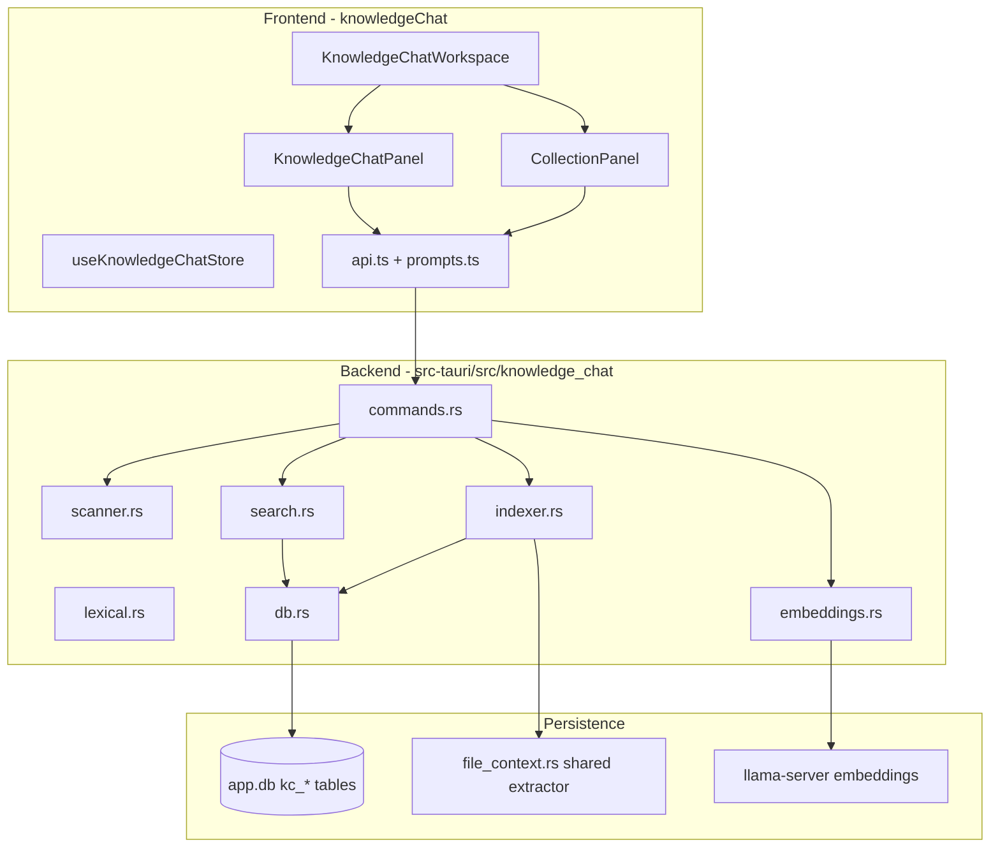

# Data Knowledge Chat Module

Independent, production-grade folder-grounded RAG for PocketMind Hybrid AI. This module is **fully separate** from Fortinet Copilot Mode (`soc` view). Removing or breaking SOC mode does not affect this module, and vice versa.

## Purpose

Users can:

1. Select any folder on the machine
2. Scan and index supported files locally
3. Ask free-form questions in a grounded chat UI
4. Receive answers based **only** on retrieved snippets from that folder's index

## Architecture Overview



## File Map

### Frontend (independent)

| Path | Role |
|------|------|
| `src/knowledgeChat/types.ts` | TypeScript types and labels |
| `src/knowledgeChat/api.ts` | Tauri invoke wrappers |
| `src/knowledgeChat/prompts.ts` | Grounded system prompt + context builder |
| `src/knowledgeChat/store.ts` | Zustand store (`nexus-knowledge-chat-storage`) |
| `src/components/knowledgeChat/KnowledgeChatWorkspace.tsx` | Main view shell |
| `src/components/knowledgeChat/CollectionPanel.tsx` | Folder selection, scan, index UI |
| `src/components/knowledgeChat/KnowledgeChatPanel.tsx` | Grounded chat UI with confidence gating |
| `src/components/knowledgeChat/EvalPanel.tsx` | Golden eval harness UI |

### Backend (independent)

| Path | Role |
|------|------|
| `src-tauri/src/knowledge_chat/mod.rs` | Module root |
| `src-tauri/src/knowledge_chat/types.rs` | Serde structs and constants |
| `src-tauri/src/knowledge_chat/scanner.rs` | Folder walk + ignore rules |
| `src-tauri/src/knowledge_chat/lexical.rs` | Tokenization, lexical vectors, keyword scoring |
| `src-tauri/src/knowledge_chat/db.rs` | SQLite CRUD for collections/files/chunks |
| `src-tauri/src/knowledge_chat/filter.rs` | Skip noisy files, min text, fingerprints |
| `src-tauri/src/knowledge_chat/chunking.rs` | Structure-aware markdown + parent/child chunks |
| `src-tauri/src/knowledge_chat/fts.rs` | SQLite FTS5 BM25 search |
| `src-tauri/src/knowledge_chat/query.rs` | Multi-part query decomposition |
| `src-tauri/src/knowledge_chat/rerank.rs` | Secondary phrase/title reranking |
| `src-tauri/src/knowledge_chat/runtime.rs` | Warm llama-server embed pool (reuse across batches) |
| `src-tauri/src/knowledge_chat/eval.rs` | Golden eval cases + metrics |
| `src-tauri/src/knowledge_chat/indexer.rs` | Parallel extract, chunk, incremental skip |
| `src-tauri/src/knowledge_chat/embeddings.rs` | Local dense embeddings via llama-server |
| `src-tauri/src/knowledge_chat/search.rs` | FTS + hybrid retrieval + confidence |
| `src-tauri/src/knowledge_chat/commands.rs` | Tauri IPC commands |

### Shared infrastructure (not SOC-specific)

- `src-tauri/src/file_context.rs` — text extraction (PDF, DOCX, code, etc.)
- `src-tauri/src/database.rs` — `kc_*` table migrations
- `src-tauri/src/llm/local.rs` — chat generation (`stream_generate`)

## Database Schema

Tables added to `%AppData%/PocketMind Hybrid AI/app.db`:

- **`kc_collections`** — collection metadata, stats, embedding model path, status
- **`kc_files`** — scanned files per collection (includes `text_fingerprint`, `priority_tier`)
- **`kc_chunks`** — searchable text chunks with lexical + optional dense vectors (JSON), parent/section metadata
- **`kc_chunks_fts`** — FTS5 virtual table synced on index writes

Foreign keys cascade on collection delete. Migration `migrate_kc_v2()` adds v2 columns and FTS table.

## Folder Scan Rules

### Automatically ignored directories

Includes: `node_modules`, `.git`, `target`, `dist`, `build`, `.next`, `.venv`, `venv`, `vendor`, `.cache`, `.idea`, `.vscode`, `.cursor`, `Pods`, and other common dev/build/cache folders.

### Supported file types

Text/code: `txt`, `md`, `csv`, `json`, `xml`, `html`, `log`, `yaml`, source code extensions, etc.

Documents: `pdf`, `docx`, `pptx`, `xlsx`, `xlsm`

### Limits

- Max files per scan: **5000**
- Max file size: **80 MB**
- Max chars indexed per file: **120,000**
- Dense embed batch: **160 chunks per llama-server run** (batched automatically)

## Indexing Pipeline (v2)

1. **Create collection** — name + folder path + embedding model path
2. **Scan folder** — incremental sync into `kc_files`, skip ignored dirs and filtered noise files
3. **Build index**
   - **Filter:** skip lockfiles, minified assets, binaries, low-signal text
   - **Extract (parallel):** rayon parallel file extraction via `file_context`
   - **Chunk:** structure-aware markdown sections + parent/child chunks
   - **Incremental skip:** unchanged files (path mtime hash + text fingerprint) skip re-chunking
   - **Lexical + FTS:** store chunks, lexical vectors, top terms, sync FTS5
   - **Dense (async):** warm `KcEmbedPool` keeps one llama-server alive across batch runs; embed only missing dense vectors
4. **Status** → `ready` when at least some files indexed successfully

Index options: `rebuild`, `build_dense`, `incremental`, `embedding_model_path`

Progress events: `kc-index-progress` (phases: `prepare`, `extract`, `dense`, `complete`)

## Retrieval Architecture (v2)

Default mode: **`hybrid_dense`** (falls back to `hybrid_lexical` if dense unavailable)

| Signal | Purpose |
|--------|---------|
| FTS5 BM25 | Full-text search via `kc_chunks_fts` |
| Keyword score | Title/file/body term matching |
| Lexical vector cosine | Fast local bag-of-terms similarity (128-dim hash vectors) |
| Dense vector cosine | Semantic similarity via local nomic-embed GGUF (candidate pool only) |
| Query decomposition | Multi-part sub-queries merged and deduped |
| RRF fusion | Combines ranked lists without score-scale issues |
| Reranker | **Primary:** Qwen3-Reranker GGUF (llama.cpp RANK) when present; then ONNX cross-encoder; then phrase/title boosts |
| MMR re-ranking | Reduces redundant chunks from the same file |
| Confidence gate | `high` / `medium` / `low` / `none` + `answer_mode` (`found`, `partial`, `not_found`) |

Search command: `kc_hybrid_search` — returns `confidence`, `confidence_score`, `answer_mode`, `sub_queries`, `fts_available`, per-hit `fts_score` and `rerank_score`.

Query embedding command: `kc_embed_query`

Eval command: `kc_run_eval` — runs default golden cases, reports recall@k and term hit rate.

## Grounded Chat Flow (v2)

1. User asks a question in **Data Knowledge Chat**
2. Frontend embeds query (if dense mode active)
3. Backend returns top-K chunks with confidence metadata
4. **Confidence gate:** if `answer_mode` is `not_found` or confidence is `none`, the UI returns a refusal without calling the LLM
5. Frontend builds `RETRIEVED SOURCES` using `context_text` / `parent_text` when available
6. **Pass 1:** grounded generation with mode-specific system prompt (partial-evidence variant when needed)
7. **Pass 2 (high confidence only):** citation verification pass; adds a warning if draft answer is flagged INVALID
8. UI shows retrieval confidence, FTS status, sub-queries, and **Sources used in last answer**

Generation defaults: temperature **0.25**, context **8192**

Conversation mode stored as: `knowledge`

## Tauri Commands

| Command | Description |
|---------|-------------|
| `kc_list_collections` | List saved collections |
| `kc_get_collection` | Get one collection |
| `kc_create_collection` | Create collection |
| `kc_delete_collection` | Delete collection + index |
| `kc_scan_collection` | Scan folder into file list |
| `kc_list_collection_files` | List files in collection |
| `kc_index_collection` | Build lexical + FTS + dense index (supports incremental) |
| `kc_hybrid_search` | Hybrid RAG search with confidence |
| `kc_run_eval` | Run golden eval harness on collection |
| `kc_embed_query` | Embed single query text |
| `kc_validate_embedding_model` | Validate GGUF + llama-server |
| `kc_set_default_embedding_model` | Persist default embed model |
| `kc_get_default_embedding_model` | Read default embed model |
| `kc_quick_scan_folder` | Preview scan without creating collection |

## Configuration

Default embedding model:

```
D:\AIModels\embeddings\nomic-embed-text-v1.5.Q4_K_M.gguf
```

Override in Collection panel or via settings key `kc_default_embedding_model`.

**Warm embedding pool:** `KcEmbedPool` in `AppState` reuses a single llama-server process for indexing batches and query embeddings. The pool restarts when the model path or batch settings change, shuts down after **10 minutes** idle, on app close, or when **Kill llama servers** is invoked.

Llama-server resolution (same as rest of app):

- `NEXUS_LLAMA_SERVER` / `LLAMA_SERVER_PATH` env vars
- `bin/llama.cpp/cpu/llama-server.exe` (and cuda/vulkan variants)

GPU/CPU policy is shared with chat via `src-tauri/src/llm/runtime_discovery.rs`:
embedding servers prefer CUDA → Vulkan → CPU with automatic `--gpu-layers`
auto-fit, falling back to partial offload and finally CPU-only when VRAM is
insufficient. The number of GPU layers honors `deploy.gpu_layers` and the
`NEXUS_GPU_LAYERS` override, and the embed pool stays conservative when the chat
model already holds the GPU.

## Organization Server embeddings (optional)

Knowledge Chat embeddings are **local-first**. When the organization server
exposes OpenAI-compatible `POST /v1/embeddings` for both partition models, you
can offload indexing and query embedding to it from **Organization Server**
settings (toggle + per-partition model ids + optional embeddings base URL). If
the remote endpoint is unconfigured or unreachable, PocketMind Hybrid AI automatically falls
back to local embeddings, so dense retrieval is never silently dropped.

| Mode | Code partition | Docs / runbooks / logs / general partitions | Chat generation |
|------|----------------|---------------------------------------------|-----------------|
| Full local | Local llama-server (partition GGUF) | Local llama-server (partition GGUFs) | Local model |
| Org chat only | Local llama-server | Local llama-server | Organization server |
| Org chat + embeddings | Org `/v1/embeddings` (per partition model id) | Org `/v1/embeddings` | Organization server |

Knowledge Chat uses **five local partitions** (code + documentation + runbooks + logs + general) with hybrid RRF retrieval and optional Qwen rerank — not a dual-only Nomic/BGE split.

Server deployment kit: [`enterprise-server/llama-cpp/docker-compose.embeddings.yml`](enterprise-server/llama-cpp/docker-compose.embeddings.yml)
(GPU) and `docker-compose.embeddings.cpu.yml` (CPU) run one `llama-server
--embeddings` process per partition model (code on 8001, knowledge on 8002).
Remote embeddings are routed through `src-tauri/src/knowledge_chat/remote_embeddings.rs`.

## User Workflow (Cookbook)

### First-time setup

1. Open sidebar → **Data Knowledge Chat**
2. Validate embedding model path
3. Browse to company folder (e.g. `D:\CompanyData`)
4. Click **Create** → **Scan Folder** → **Build Index**
5. Wait for status **Ready** and dense status **ready**
6. Select a local chat model in Models if not already selected
7. Ask questions in the chat panel

### Re-index after folder changes

1. Select collection
2. Click **Scan Folder** (incremental file sync)
3. Enable **Incremental index** and click **Build Index**, or **Rebuild** for a full reset

### Run retrieval eval

1. Ensure collection status is **Ready**
2. Open **Golden Query Harness** panel
3. Click **Run Eval** to score default cases (recall@k, term coverage)

### Troubleshooting

| Issue | Action |
|-------|--------|
| No chunks indexed | Check file types are supported; open Diagnostics |
| Dense status failed | Validate embedding model; try CPU llama-server |
| Answers blocked before generation | Low retrieval confidence — rephrase, increase Top K, or rebuild index |
| FTS empty after upgrade | Run **Rebuild** once after v2 migration to populate `kc_chunks_fts` |
| Scan truncated at 5000 files | Split into multiple collections |

## Independence Guarantees

- No imports from `src/soc*.ts` or SOC components
- No calls to `scan_soc_knowledge_folder`, `embed_soc_dense_texts`, etc.
- Separate SQLite tables (`kc_*`)
- Separate Zustand persist key
- Separate sidebar view (`knowledge-chat`)
- Shared only with generic app infrastructure (file extraction, LLM runtime, SQLite connection)

## Offline PDF OCR + optional Online Image RAG

**Offline is the default.** Scanned PDFs are OCR’d locally via `scripts/soc_pdf_ocr.py` when indexing.

| Setting | Default | Notes |
|---------|---------|--------|
| `ocr.engine` | `auto` | When ready: Unlimited-OCR (CUDA) → Docling → legacy Tesseract/Windows OCR. Also `unlimited` / `docling` / `legacy`. |
| `ocr.preprocess` | on | OpenCV deskew/binarize when `opencv-python-headless` is installed |
| `ocr.caption_figures` | off | Wraps tables/figures for search at index time (offline) |
| `ocr.llm_repair` | off | Stronger OCR text repair; raw sidecar kept; optional `NEXUS_OCR_LLM_REPAIR_CMD` |
| `kc.verify_llm_answer` | on | Pass-2 citation verifier before showing LLM drafts |
| `image_rag.*` | **off** | OpenAI-compatible vision; requires global switch **and** per-collection opt-in |

Optional Python extras (not bundled in tester zips):

```bash
pip install pymupdf pillow pytesseract opencv-python-headless docling
```

**Online Image RAG privacy:** page/region images leave the device only when (1) global Image RAG is enabled in Security settings, (2) the collection checkbox is confirmed, and (3) URL/model/API key are configured. Audit event: `image_rag.query` (no raw images in logs).

Configure under **Security / Advanced → PDF OCR & optional Online Image RAG**, and per collection under **Allow Online Image RAG**.

### Regression checklist (OCR / Image RAG)

- [ ] Text-layer PDF indexes without OCR; scanned PDF produces non-empty chunks
- [ ] Without Docling/OpenCV installed, legacy OCR path still works
- [ ] Code partition / AST path unchanged; Server RAG thin client unchanged
- [ ] Mac Metal / Windows llama.cpp runtime discovery unchanged
- [ ] Existing OCR cache sidecars remain readable; engine/preprocess changes bump cache namespace
- [ ] Image RAG global off → zero outbound vision calls
- [ ] Opt-in + bad API key → offline answer still returned

## Future Extensions

- Collection export/import
- Multi-folder collections
- Server-side vector index (sqlite-vec / hnswlib) for very large corpora

## Build Notes

Rust build with custom target dir (if C: space is low):

```powershell
$env:CARGO_TARGET_DIR='D:\DevCache\Cargo\target\nexus-ai'
cd src-tauri
cargo check
```

Frontend:

```powershell
npm run build
```

Restart the Tauri app after backend changes to load new commands and DB migrations.
